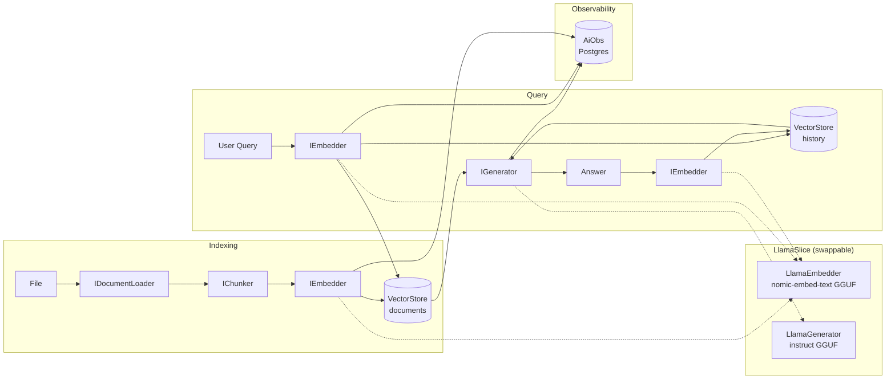

# RagLab

A hand-built RAG (Retrieval-Augmented Generation) pipeline in .NET 10 / C#, built to understand the technology from the ground up — not a framework wrapper, but a transparent implementation where every component is explicit.

## Why This Exists

Most RAG demos hide the interesting parts behind LangChain or Semantic Kernel. This project builds the pipeline by hand — document loading, fixed-size chunking, cosine similarity search, dual vector stores, session memory, and structured observability — so each decision is visible and defensible in an interview or code review.

## Architecture Overview



## Key Design Decisions

- **Local-first, no cloud dependency.** Both embedding and generation run via LlamaSharp against local GGUF models. No API keys, no network calls, no data leaving the machine. The Claude API is a planned swap, not the default.

- **Dual vector store for session memory.** Document chunks and conversation history live in separate keyed `InMemoryVectorStore` instances (`"documents"` / `"history"`). Mixing them into one store lets history crowd out document chunks when topK is small — a subtle but common RAG failure mode.

- **Vertical Slice per model provider (`IModelSlice`).** Each provider owns its embedder, generator, chunk size, and `RecommendedTopK` in one self-contained registration. Switching from LlamaSharp to the Claude API is a one-line change in `Program.cs` with compile-time completeness guarantees.

  ```csharp
  IModelSlice slice = new LlamaSlice();
  // or: new ClaudeSlice();
  slice.Register(builder.Services, builder.Configuration);
  ```

- **Zero-dependency Core.** `RagLab.Core` has no external NuGet dependencies beyond `Microsoft.Extensions.AI.Abstractions`. Domain models and interfaces are framework-free, making the abstraction boundary impossible to violate accidentally.

- **Structured pipeline observability via AiObs.** Every pipeline step (load, chunk, embed, retrieve, generate, store history) emits a named span with typed input/output and error capture. Traces are persisted to PostgreSQL. This was added to make latency and failure points visible rather than relying on log parsing.

## Tech Stack

| Layer         | Choice                                                      |
|---------------|-------------------------------------------------------------|
| Runtime       | .NET 10, C#                                                 |
| LLM inference | LlamaSharp — local GGUF models (no runtime tokenizer dep)   |
| Embedding     | `nomic-embed-text-v1.5` GGUF via LlamaSharp                 |
| Generation    | Instruction-tuned GGUF (Qwen 2.5, Mistral, Phi-3, etc.)    |
| Vector store  | In-memory cosine similarity (hand-rolled, no library)       |
| LLM interface | `Microsoft.Extensions.AI` abstractions                      |
| DI / hosting  | `Microsoft.Extensions.DependencyInjection` + keyed services |
| Observability | `AiObs.Postgres` — structured traces to PostgreSQL          |

## Project Status

**Phase 1 — complete.** Full local pipeline: document loading (`.txt`, `.md`), fixed-size chunking with overlap, in-memory cosine similarity search, dual vector stores, session memory, LlamaSharp embedder + generator with native GGUF chat template, structured observability.

**Phase 2 — planned.** ClaudeSlice (Claude API generator), Qdrant vector store. Core interfaces unchanged.

**Phase 3 — planned.** Hybrid retrieval (BM25 + semantic), reranking.

## Getting Started

1. Place GGUF model files in `models/` (gitignored):
   - Embedding: `nomic-embed-text-v1.5.f16.gguf`
   - Generation: any instruction-tuned GGUF

2. Set model paths and PostgreSQL connection string in `src/RagLab.Console/appsettings.json`.

3. Run:
   ```bash
   dotnet run --project src/RagLab.Console
   ```

## Project Structure

```
RagLab/
├── src/
│   ├── RagLab.Core/             # Domain models, interfaces — zero external deps
│   ├── RagLab.Infrastructure/   # LlamaSharp, vector store, chunker, loaders, slices
│   └── RagLab.Console/          # Composition root, DI wiring, pipeline demo
├── docs/                        # Sample documents for indexing
├── models/                      # GGUF model files (gitignored)
└── CLAUDE.md
```
